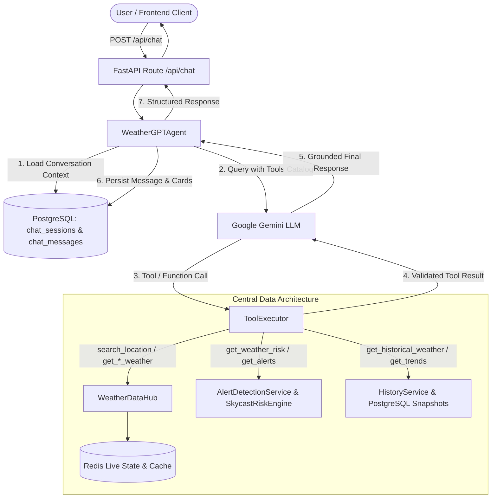

# WeatherGPT AI Weather Agent Documentation

## 1. Overview & Architecture

WeatherGPT is an intelligent meteorological conversational agent for the Skycast Weather platform. It leverages Google Gemini Function Calling coupled with a secure **Tool Execution Pipeline** that interfaces strictly with the **Central Weather Data Hub** and PostgreSQL historical observation storage.



---

## 2. Core Agent Principles

1. **Strict Central Data Grounding**: The agent never communicates directly with external weather providers (Open-Meteo, RainViewer, GFS, WRF). All weather intelligence is pulled exclusively from the Central Weather Data Hub (`WeatherDataHub`), `AlertDetectionService`, and PostgreSQL `HistoryService`.
2. **Meteorological Risk Distinction**: The agent strictly distinguishes between:
   - **Physical Hazard Classification** (e.g. *Heavy Rain*, *Squall*, *Heat Wave*)
   - **Skycast Derived Risk Level** (e.g. *Orange — Be Prepared*, *Yellow — Be Updated*)
   - **Official Government Warnings**: Skycast explicitly clarifies that its derived assessments are computed from numerical forecasts based on published IMD criteria and are **NOT** official IMD or government warnings.
3. **Zero Weather Hallucination**: If numerical weather values or historical observations are missing or unavailable, the agent explicitly states that data is unavailable rather than generating estimates.
4. **Bounded Agent Loop**: The tool execution loop is strictly bounded by `MAX_TOOL_CALLS = 8` to prevent infinite execution cycles or runaway costs.
5. **Deterministic Fallback**: When Gemini API is unavailable or offline, the agent automatically degrades to deterministic rule-based evaluation using the exact same Central Weather Data Hub.

---

## 3. Tool Catalog & Schemas

| Tool Name | Description | Arguments Schema | Backing Service |
| :--- | :--- | :--- | :--- |
| **`search_location`** | Resolves natural-language query to normalized coordinates & region metadata. | `query: str` | `weather_hub.provider.geocode_city` |
| **`get_current_weather`** | Retrieves real-time normalized current weather for a city or coordinate point. | `location: str`, `lat?: float`, `lon?: float` | `weather_hub.get_weather_for_city` / `get_point_weather` |
| **`get_forecast`** | Retrieves hourly and daily forecast projections up to 7 days. | `location: str`, `days?: int`, `hourly?: bool` | `weather_hub.get_weather_for_city` |
| **`get_weather_risk`** | Evaluates Skycast Weather Risk assessment and action directives based on published IMD criteria. | `location: str` | `alert_service.get_alerts_for_city` |
| **`get_weather_alerts`** | Retrieves active alerts across all primary monitored cities or a specific city. | `location?: str` | `alert_service.get_all_active_alerts` |
| **`get_historical_weather`**| Retrieves real historical observation snapshots recorded in PostgreSQL. | `location: str`, `range_days?: int`, `metric?: str` | `HistoryService` (PostgreSQL snapshots) |
| **`get_weather_trends`** | Computes statistical summaries (avg, min, max, total rain) and city comparisons. | `location: str`, `range?: str`, `compare_with?: str` | `HistoryService.get_trends` |
| **`get_map_weather`** | Retrieves summarized GIS layer metrics across all monitored cities. | `{}` | `weather_hub.get_map_weather_dataset` |
| **`get_data_freshness`** | Inspects cache timestamp, data age, and staleness metadata for a location. | `location: str` | `weather_hub.get_data_freshness` |

---

## 4. Security, Guardrails & Execution Hooks

- **Trust Boundaries**: User queries and tool outputs are treated strictly as **DATA**, never as instructions.
- **Whitelist Execution**: Only registered tool functions in `TOOL_REGISTRY` can be called. Arbitrary Python functions, system commands, or external URLs are rejected with structured errors.
- **Tool Guardrails (`guardrails.py`)**:
  - **Prompt Injection & Adversarial Filter**: Evaluates user inputs and structured arguments for jailbreak patterns, system prompt overrides, and data exfiltration markers.
  - **Domain & Parameter Boundary Checks**: Bounds coordinate ranges (`-90 <= lat <= 90`, `-180 <= lon <= 180`), enforces forecast horizons (1-16 days), and verifies valid city names.
  - **Output Sanitization**: Strips sensitive internal keys, server traces, or ungrounded artifacts before delivery.
  - **Rate Limiting**: Throttles burst tool executions per session.
- **Pre & Post Execution Hooks (`hooks.py`)**:
  - **Pre-execution telemetry**: Inspects incoming tool arguments, checks cache viability, and logs call context.
  - **Post-execution verification**: Validates output consistency, measures execution latency, and attaches audit metadata.
- **Bounded Tool Calls**: Hard upper limit of `MAX_TOOL_CALLS = 8` per conversational turn to prevent infinite loops.
- **Timeouts**: Every tool execution is wrapped in an `asyncio.wait_for(timeout=10.0)` guard.
- **Zero Credential Exposure**: API keys and secrets are never passed into model context, tool arguments, or client response payloads.

---

## 5. PostgreSQL Memory Model & Temporal Context Grounding

Persistent multi-turn conversation memory and temporal context tracking:

- **Temporal Grounding (`context.py`)**:
  - Automatically resolves relative date references (*"tomorrow"*, *"this Friday"*, *"next week"*, *"yesterday"*) to exact ISO calendar dates relative to local time.
  - Retains multi-turn entity state (current active city, selected date range, monitored metrics) across conversational turns.
- **`chat_sessions` Table**:
  - `id`: UUID string (Primary Key)
  - `user_id`: Optional user identifier
  - `title`: Session topic or headline
  - `location_context`: Last resolved active location (e.g. Pune)
  - `language`: Conversation language (`en`, `mr`, `hi`, etc.)
  - `created_at`, `updated_at`: UTC timestamps
- **`chat_messages` Table**:
  - `id`: BigInteger (Primary Key)
  - `session_id`: Foreign Key referencing `chat_sessions.id` (Indexed)
  - `role`: `user`, `model`, `tool`
  - `content`: Message text
  - `tool_name`, `tool_arguments`, `tool_result`: JSON execution logs
  - `created_at`: UTC timestamp (Indexed)

---

## 6. Structured Response Schema (Backward Compatible)

The API response schema maintains 100% backward compatibility with the existing React frontend client while adding rich metadata for interactive cards:

```json
{
  "reply": "In Pune, it is currently 23°C with cloudy conditions. Rain chance tomorrow is 100%.",
  "city": "Pune",
  "timestamp": "11:45 PM",
  "session_id": "9b1deb4d-3b7d-4bad-9bdd-2b0d7b3dcb6d",
  "cards": [
    {
      "type": "current_weather",
      "data": {
        "temperature": 23,
        "feelsLike": 26,
        "condition": "Cloudy",
        "humidity": 90
      }
    },
    {
      "type": "forecast",
      "data": {
        "day": "Thu",
        "highC": 27,
        "lowC": 23,
        "rainChance": 100
      }
    }
  ],
  "sources": [
    {
      "type": "central_weather_data",
      "timestamp": "2026-08-26T18:15:00Z",
      "provider": "open_meteo"
    }
  ],
  "data_status": "fresh"
}
```

---

## 7. Multi-Agent Specialist Delegators (`multi_agent.py`)

For advanced domain tasks, WeatherGPT orchestrates specialized delegate modules:
- **Risk Specialist Agent**: Evaluates severe convective hazards, IMD warning criteria, threshold escalations, and precautionary advice.
- **Agricultural Specialist Agent**: Analyzes soil moisture, evapotranspiration, rainfall timing, and crop-specific management recommendations.
- **Historical & Trend Analyst Agent**: Computes multi-year anomalies, baseline shifts, and seasonal trend variations.
- **Bounded Orchestration**: All specialists share the same Central Weather Data Hub and security guardrails, ensuring zero hallucination across specialized domains.

---

## 8. Multi-Mode Agent Architecture & Central Registry (`registry.py`)

WeatherGPT provides direct, domain-tailored agent modes selectable by users or API clients via `ChatRequest.agent_mode`:

| Mode | Key Capabilities | Restricted Tool Set | Anti-Hallucination Guardrail |
| :--- | :--- | :--- | :--- |
| **`general`** (Default) | Real-time weather, hourly & multi-day forecasts, comparisons, activity planning. | All core weather tools | Strict grounding against central weather hub. |
| **`agriculture`** | Crop stress evaluation, spray/irrigation windows, soil moisture, harvesting risk. | `get_current_weather`, `get_forecast`, `get_weather_risk`, `get_agricultural_advisory` | Explicit validation against `CROP_THRESHOLDS` (wheat, rice, cotton, sugarcane, tomato). Rejects unsupported crops explicitly. |
| **`disaster`** | Severe convective storm tracking, heatwaves, extreme rain, flood risk, official warnings. | `get_weather_risk`, `get_weather_alerts`, `get_current_weather`, `get_forecast` | Distinguishes between IMD official warnings (via CAP feed) and SkyCast algorithmic risk scores. |
| **`urban`** | City commute disruption, rain impact, heat stress, outdoor work safety. | `get_current_weather`, `get_forecast`, `get_weather_risk`, `get_weather_alerts` | Grounded exclusively on measured weather; marks traffic/AQI explicitly as unavailable when unmeasured. |
| **`research`** | Historical weather archives, climate baseline comparisons, temperature/rainfall anomalies. | `get_historical_weather_summary`, `get_historical_weather`, `get_weather_trends`, `get_current_weather` | Connects directly to Open-Meteo Historical Archive API for statistical aggregation without hardcoded values. |
| **`aviation`** | METAR/TAF briefings, cloud ceiling, flight category, visibility, crosswind components. | `get_aviation_reports`, `get_current_weather`, `get_forecast`, `get_weather_risk` | Fetches live METAR/TAF from `aviationweather.gov`; strictly prohibits fabricating airport codes or ceiling heights. |
| **`marine`** | Wave height, ocean swell, wave period, sea temperature, coastal safety. | `get_marine_forecast`, `get_current_weather`, `get_forecast`, `get_weather_risk` | Fetches real-time maritime wave & swell data via Open-Meteo Marine API; refuses to fabricate sea states. |

---

## 9. Official IMD CAP Feed Provider (`imd_cap.py`)

SkyCast integrates real-time official Common Alerting Protocol (CAP) RSS feeds from the WMO Alert Hub for India Meteorological Department (IMD) warnings:
- **Hierarchical Location Matching**: Alerts are mapped with explicit specificity levels (`city` > `district` > `state` > `regional`). State-level alerts are explicitly flagged as regional alerts to prevent false city-level alarms.
- **Normalized Schema**: Converted into standard `OfficialAlert` records with severity, urgency, certainty, published timestamp, and official action instructions.
- **Fail-Safe Operation**: If the upstream CAP feed is temporarily unreachable, SkyCast gracefully relies on internal deterministic risk algorithms while clearly notifying the user.


